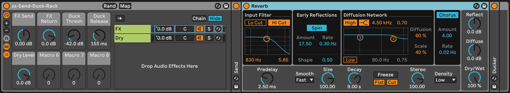
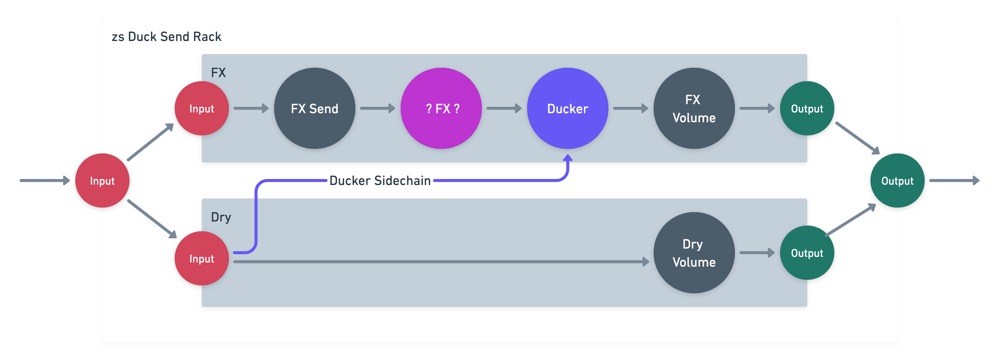

# zs Send Duck Rack

This is a utility rack that implements two basic utilities:
* the functionality of an effects send/return channel but without having to create a return track
* a ducking mechanism for the effects chain

By using parallel chains for the dry and effects signals, you can have a lot of control of the presence of effects in the mix, different than if the effects had a wet/dry control. This way, you can keep the dry signal at a consistent volume but vary the wet volume, and any other combination you can think of.

Some effects have a ducking function, but it's possible with standard Ableton devices to give any effect or chain of effects ducking capability. Here, we use the standard Ableton Compressor device, which is connected to the `Duck Thresh` and `Duck Release` knobs.

## Installation / Setup

If you just want to download and install the device, then go to the [frozen/](https://github.com/zsteinkamp/zs-Send-Duck-Rack/tree/main/frozen) directory and download the newest version there.

### Changelog

* [0.0.1](https://github.com/zsteinkamp/zs-Send-Duck-Rack/raw/main/frozen/zs-Send-Duck-Rack-0.0.1.adg) - 2022-11-30 - Initial frozen release.

## Usage

### Mapped Controls
The effects rack has 5 mapped knobs.

* `FX Send` - The amount of the input signal to send to the FX chain.
* `FX Return` - The volume level of the FX chain to mix into the output.
* `Duck Thresh` - The loudness threshold to engage ducking.
* `Duck Release` - How quickly the ducking returns to normal.
* `Dry Level` - The level of the input signal to pass directly to the output.

## How does it work?

This is an Audio Effect Rack with two chains. The FX chain contains a utility device to control input volume, any effects you want to use, and a compressor that does the ducking. The Dry chain doesn't have any effects on it.

The ducking compressor in the FX chain is set up to sidechain from the Dry chain, pre-FX. Open it all up and check it out and make it your own!

## Contributing

I'd love to hear from anyone who is using this, or any suggestions or problems you might have with it. Just send me an email! zack@steinkamp.us

## TODO
* ...
